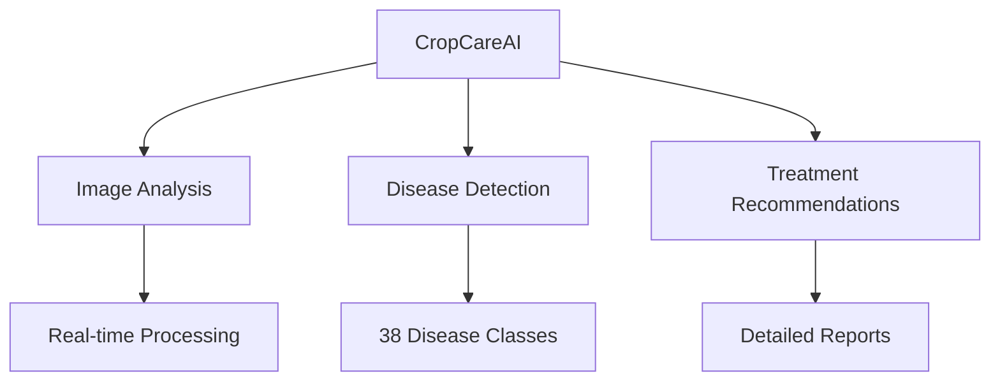
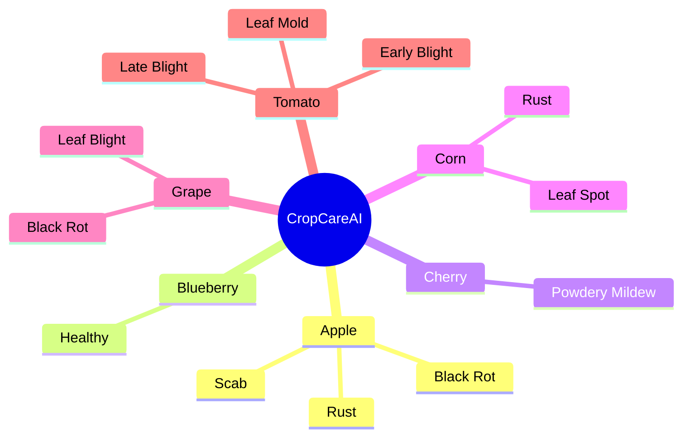
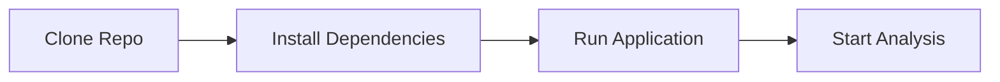
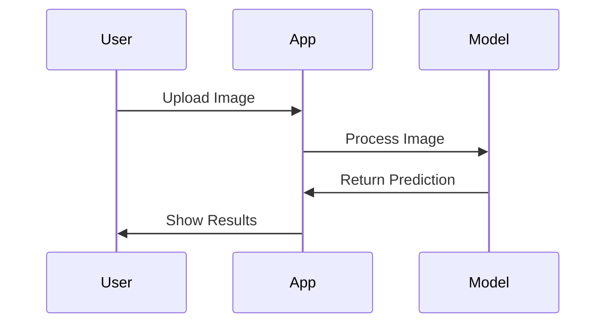
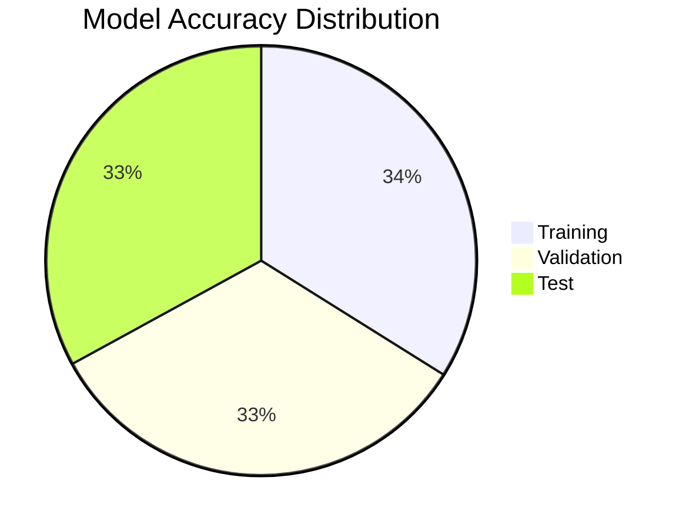
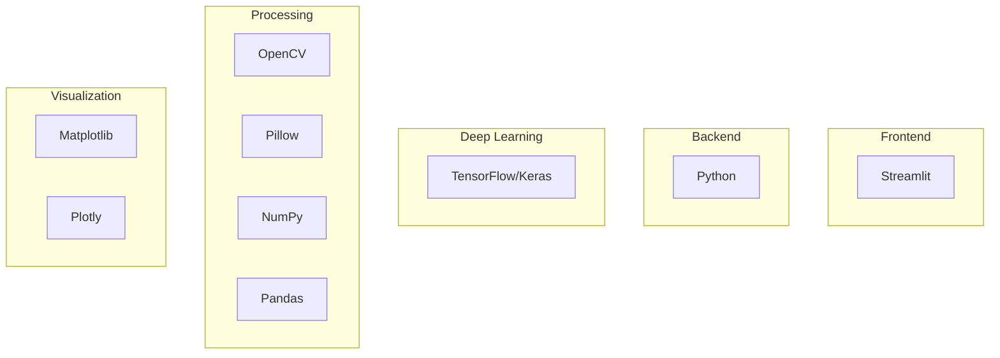
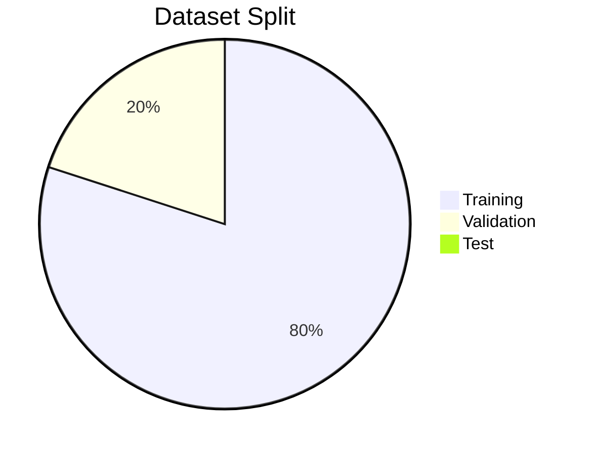
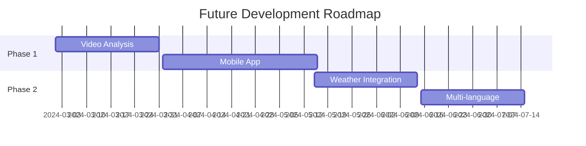
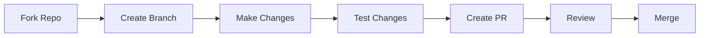
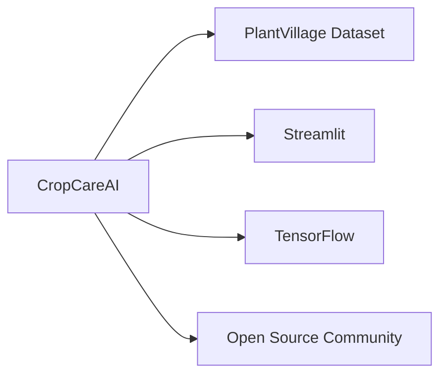

# 🌿 CropCareAI: Plant Disease Recognition System

<div align="center">


[](https://www.python.org/)
[](https://www.tensorflow.org/)
[](https://streamlit.io/)
[](LICENSE)

</div>

## 📋 Overview

CropCareAI is an advanced plant disease recognition system that leverages deep learning to identify various plant diseases from images. This tool helps farmers, gardeners, and agricultural professionals quickly detect and address plant health issues, contributing to better crop management and yield optimization.

## ✨ Features

<details>
<summary>🔍 Click to expand features</summary>

### Core Features



### Supported Plants



</details>

## 🚀 Getting Started

### Prerequisites

| Requirement | Version |
| ----------- | ------- |
| Python      | 3.8+    |
| pip         | Latest  |
| RAM         | 8GB+    |
| Storage     | 1GB+    |

### Installation



1. Clone the repository:

```bash
git clone https://github.com/RajaMahanty/crop-care-ai.git
cd crop-care-ai
```

2. Install required dependencies:

```bash
pip install -r requirements.txt
```

3. Run the application:

```bash
streamlit run main.py
```

## 🎯 Usage



## 📊 Model Performance

### Accuracy Metrics



### Performance Statistics

| Metric              | Value |
| ------------------- | ----- |
| Training Accuracy   | 98.5% |
| Validation Accuracy | 96.2% |
| Test Accuracy       | 95.8% |
| Inference Time      | 0.8s  |
| Model Size          | 90MB  |

## 🛠️ Technical Stack



## 📚 Dataset Information

### Dataset Distribution



### Dataset Statistics

| Category          | Count  | Percentage |
| ----------------- | ------ | ---------- |
| Training Images   | 70,295 | 80%        |
| Validation Images | 17,572 | 20%        |
| Test Images       | 33     | <1%        |
| Total Images      | 87,900 | 100%       |

## 🔄 Future Enhancements



## 🤝 Contributing

### Development Workflow



## 📝 License

This project is licensed under the MIT License - see the LICENSE file for details.

## 🙏 Acknowledgments



## 📧 Contact

- GitHub Issues: Create an issue
- Repository: [crop-care-ai](https://github.com/RajaMahanty/crop-care-ai)

---

<div align="center">
Made with ❤️ for better agriculture
</div>
