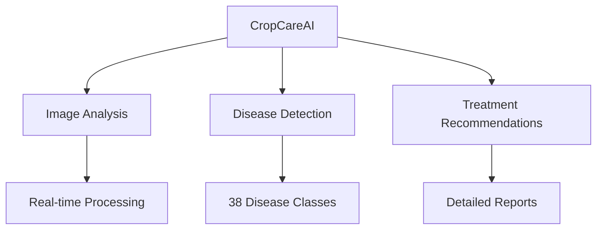
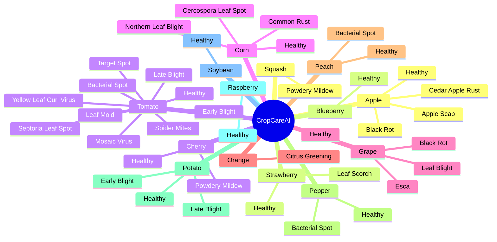
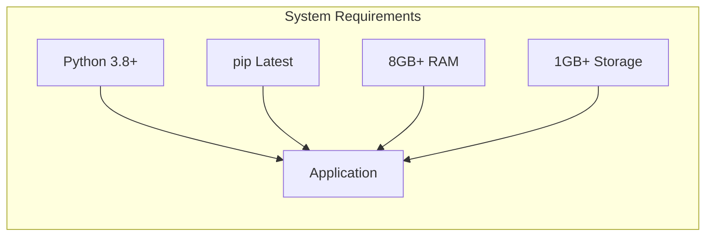
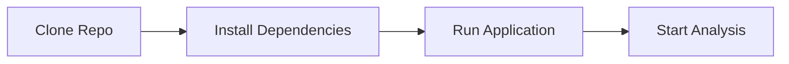
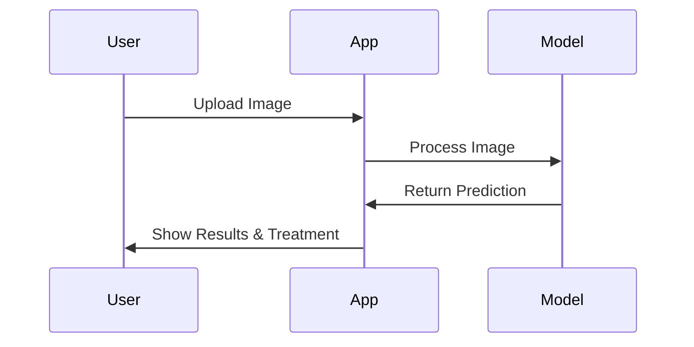
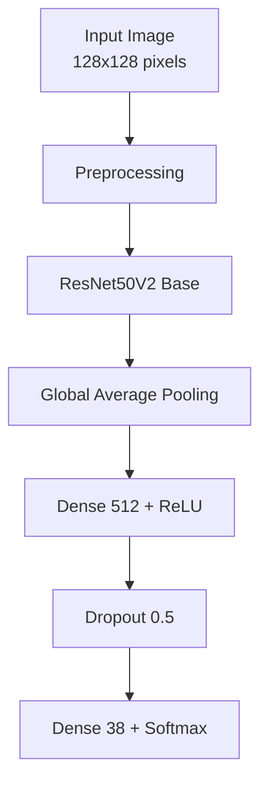
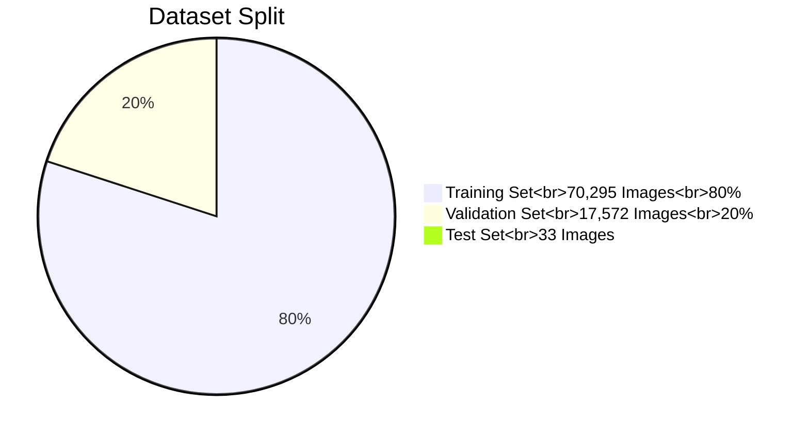
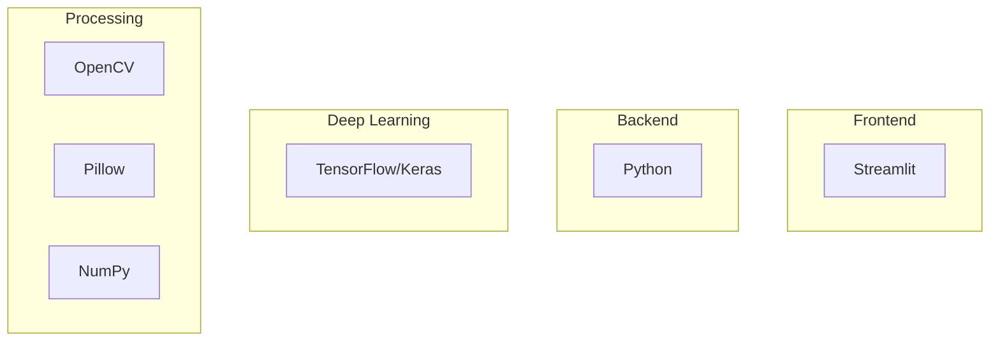
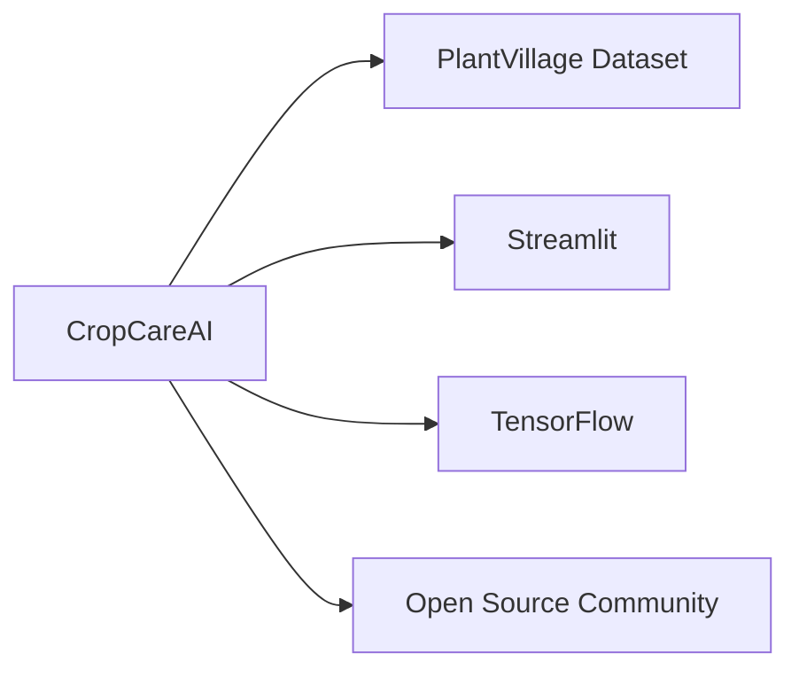

# 🌿 CropCareAI: Plant Disease Recognition System

<div align="center">


[](https://www.python.org/)
[](https://www.tensorflow.org/)
[](https://streamlit.io/)
[](LICENSE)

</div>

## 📋 Overview

CropCareAI is an advanced plant disease recognition system that leverages deep learning to identify various plant diseases from images. This tool helps farmers, gardeners, and agricultural professionals quickly detect and address plant health issues, contributing to better crop management and yield optimization.

## ✨ Features

<details>
<summary>🔍 Click to expand features</summary>

### Core Features



### Supported Plants and Diseases



</details>

## 🚀 Getting Started

### Prerequisites



### Installation



1. Clone the repository:

```bash
git clone https://github.com/RajaMahanty/crop-care-ai.git
cd crop-care-ai
```

2. Install required dependencies:

```bash
pip install -r requirements.txt
```

3. Run the application:

```bash
streamlit run main.py
```

## 🎯 Usage



### Application Flow

1. Launch the application
2. Navigate to "Disease Recognition" in the sidebar
3. Upload a plant leaf image
4. Click "Show Image" to preview
5. Click "Predict" to analyze
6. View results including:
   - Disease identification
   - Disease information
   - Recommended treatment options

## 📊 Model Details

### Model Architecture



### Model Performance

The model was trained for 6 epochs and achieved excellent performance metrics:

- Overall Accuracy: 96%
- Training Accuracy: 97.06%
- Validation Accuracy: 95.94%

#### Detailed Performance Metrics

The model shows strong performance across all 38 classes with:

- Average Precision: 96%
- Average Recall: 96%
- Average F1-Score: 96%

Notable class-wise performance:

- High accuracy (>98%) for most healthy plant classes
- Strong performance for common diseases like:
  - Apple Scab (96% F1-score)
  - Grape Black Rot (96% F1-score)
  - Tomato Yellow Leaf Curl Virus (98% F1-score)
  - Potato Early Blight (95% F1-score)

### Training Process

- Training Set: 70,295 images
- Validation Set: 17,572 images
- Image Size: 128x128 pixels
- Color Mode: RGB
- Batch Size: 32
- Optimizer: Adam (learning_rate=0.001)
- Loss Function: Categorical Crossentropy
- Early Stopping: Patience=5, monitor='val_loss'
- Model Checkpoint: Save best model based on validation accuracy

The model shows consistent improvement across epochs with minimal overfitting, as evidenced by the close training and validation accuracy curves.

## 📚 Dataset Information

### Dataset Distribution



### Dataset Overview

- Total Images: 87,900
- Training Set: 70,295 images (80%)
- Validation Set: 17,572 images (20%)
- Categories: 38 different classes
- Image Type: RGB images of healthy and diseased crop leaves
- Image Size: 128x128 pixels
- Data Augmentation: Random rotation, width/height shifts, shear, zoom, horizontal flip

## 🛠️ Technical Stack



## 🔄 Future Enhancements


## 🤝 Contributing

### Development Workflow


## 📝 License

This project is licensed under the MIT License - see the LICENSE file for details.

## 🙏 Acknowledgments



## 📧 Contact

- GitHub Issues: Create an issue
- Repository: [crop-care-ai](https://github.com/RajaMahanty/crop-care-ai)

---

<div align="center">
Made with ❤️ for better agriculture
</div>
